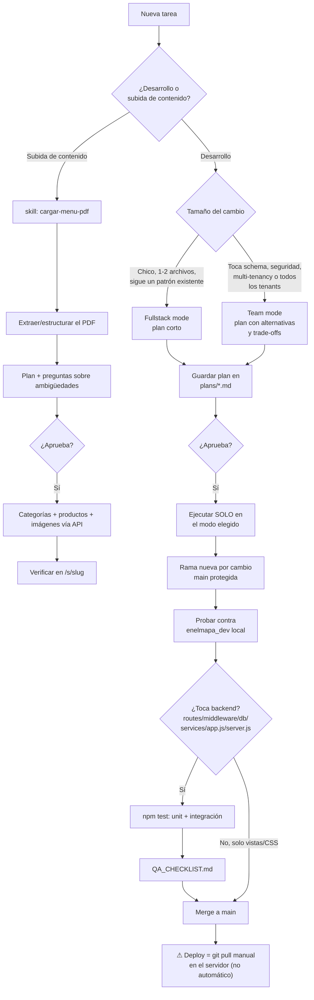

# Flujo de trabajo — EnElMapa

Acordado con el usuario el 2026-08-06. Aplica a cualquier sesión de Claude
Code que trabaje en este proyecto, en cualquier máquina.

## Reglas fijas (en ambos caminos)

- Nunca ejecutar sin plan aprobado primero.
- Nunca correr `npm run seed` contra producción — borra **todos** los
  tenants (ver `.claude/skills/enelmapa-dev/SKILL.md`).
- Nunca tocar `products`/`categories`/etc. sin filtrar por `business_id`.
- Todo cambio que toque `routes/`, `middleware/`, `db/`, `services/`,
  `app.js` o `server.js` requiere `npm test` en verde y `QA_CHECKLIST.md`
  completo antes de mergear. Cambios solo de vistas/CSS quedan exceptuados.
- Un merge a `main` **no** implica que ya esté desplegado — el deploy es un
  `git pull` manual en el servidor, avisar explícitamente cuando algo está
  listo para eso.

## Dónde vive cada cosa

- `.claude/skills/cargar-menu-pdf/` — cómo cargar el menú (PDF) de un negocio
  al admin ya desplegado, por HTTP, sin tocar código.
- `.claude/skills/enelmapa-dev/` — cómo desarrollar sobre este repo (setup
  local, reglas no-negociables, convenciones de código).
- `tests/` — suite Jest + Supertest (unit + integración). Ver `TESTING.md`.
- `QA_CHECKLIST.md` — checklist manual pre-merge para cambios de backend.
- `.claude/memory-snapshot/` — contexto acumulado en la máquina donde se
  armó este flujo por primera vez (ver el README ahí).
- `PROCEDIMIENTO_CARGA_MENU.md` — versión larga/narrativa del procedimiento
  de carga de menús (el skill es la versión accionable de esto).
